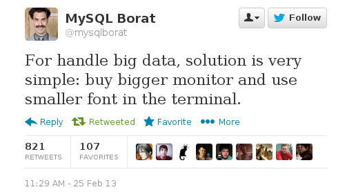
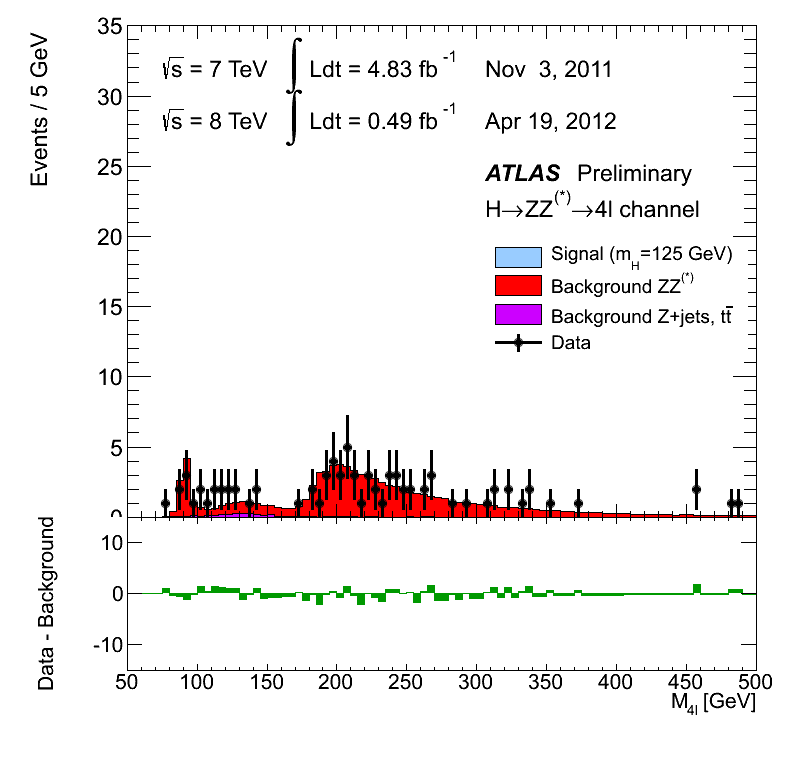
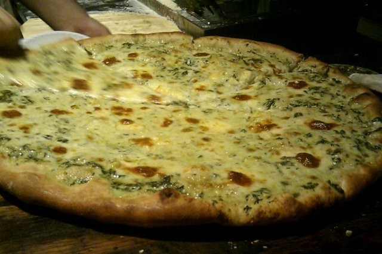
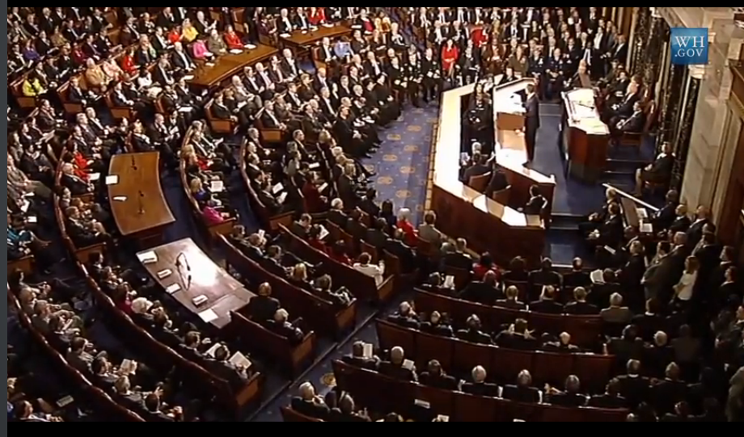
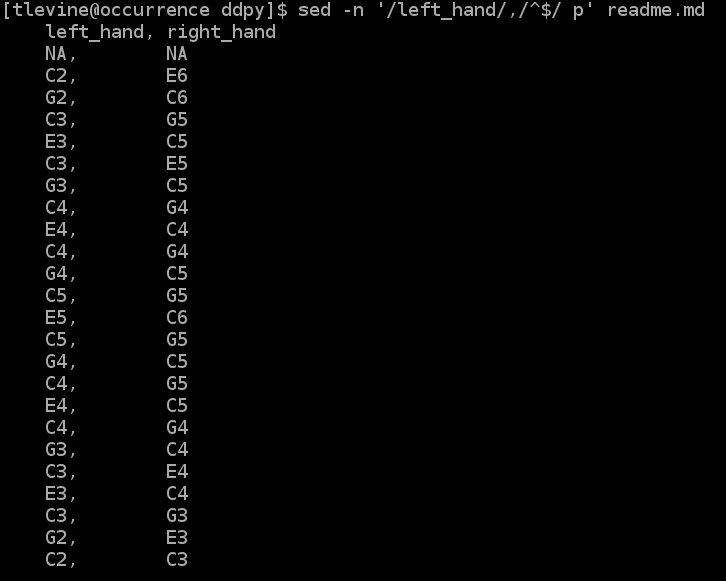
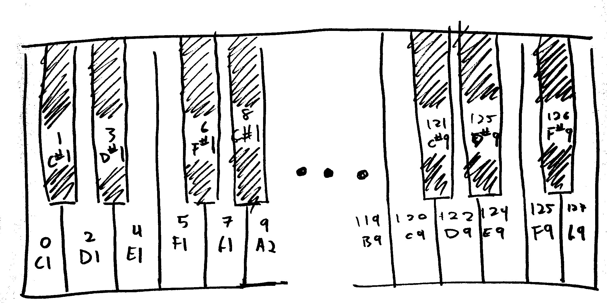
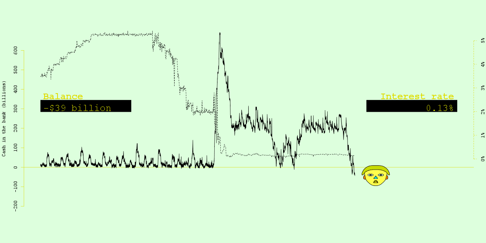

Data music for big data analysis
=====

## Introduction
[](https://twitter.com/mysqlborat/status/306078371182428161)

Today, we produce more digital content than ever before.
Making sense of the data is becoming harder as the data
get more complex, so we need to develop new tools.
In particular, we need something more powerful than data visualization.

### The problem with data visualization
Data visualization cannot support wide datasets, with lots
of variables.


<!-- http://upload.wikimedia.org/wikipedia/commons/2/29/Minard.png -->

This plot of Napoleon's march is seen as an exceptional
piece of data visualization that conveys the multivariate
relationships in the world, and it contains about seven
variables: Longitude, latitude, date, temperature, direction
branch, army size. (You could arrive at a slightly different
number if define the variables differently.)

The best of visualizations only supports a few variables,
but today's data contain thousands variables.
Typically, we deal with this by reducing dimensions before plotting
or by making multiple plots, but these approaches lose information.
Rather than using these lossy visual approaches, we would like to
represent multivariate data in a more raw form.
How can we represent more raw variables?

Animations can help.

[](img/4l-FixedScale-NoMuProf2.gif)

But that only gets us a little bit further.

I think the future is in multisensory data experiences. Food is the prime
example of this, as we use all five senses in experiencing it.


<!-- http://www.flickr.com/photos/igorschwarzmann/4423705330/ -->

Unfortunately, computers don't have particularly good APIs for touch,
taste or smell, so it is harder to represent your data for these senses.
On the other hand, they do have good sound APIs, so we can start there.

### Other reasons for music
As we explained above, music gives lets us use a different sense (sound) that visuals do.
If we combine music with visuals, we can consume data through multiple
senses and thus experience higher-dimensional data. This ability to
represent multivariate data is the main promise I see in data-driven
music, but I see some side benefits too.

#### Accessibility

<!-- http://www.section508.gov/images/open_doors_seal-b.jpg

* [Section 508](https://www.section508.gov/)
* [Web Content Accessibility Guidelines](http://www.w3.org/TR/WCAG10/
 -->

#### Reaching young people
Data is in.

[](http://www.youtube.com/watch?v=JwuEnyV1Cb0)

### History of ddpy
[csv soundsystem](http://csvsoundsystem.com) makes
music from data, and we have developed a few tools
to help us do that. We started out by with disgusting
hacks in R, which we eventually abstracted into a
package called
[data-driven rhythms (ddr)](https://github.com/csv/ddr).
dd**py** is confusingly named after the package dd**r**,
even though there's no pun anymore.
The API for ddpy is inspired largely by a prototype
we build for making music
[from Google Spreadsheets](https://github.com/csv/sheetmusic).

### Today
Today, you'll learn how to transform a dataset into music.
We'll use the `ddpy` package for this tutorial, but the
same concepts apply regardless of what tools you use to
turn your data into music.

## Install
You'll need a means of playing MIDI files.
[timidity++](http://timidity.sourceforge.net/) is one option.
Or just use a website like [SolMiRe](http://solmire.com).

You'll also need [ddpy](https://github.com/csv/ddpy).

    pip install ddpy

## Imports
The code examples below expect the following to have been run.

```python
import numpy
import pandas
import pandas.io.wb
from ddpy import to_midi
```

## Tables
I see the whole world as collections of things,
which I like to represent as data tables. Rows
are records, and columns are variables.

I see music the same way. A given sound is a
function of the notes that are being played by
various instruments, and a song consists of a
collection of sounds. Thus, columns are
instruments, rows are beats (or some other
time-related thing), and cells contain notes.

Here's a passage from Chopin's
[Étude Op. 10, No. 1](http://en.wikipedia.org/wiki/%C3%89tude_Op._10,_No._1_%28Chopin%29)
in ordinary sheet music.


<!-- http://upload.wikimedia.org/wikipedia/commons/0/0e/Chopin_Op._10_No._1_Godowsky%27s_first_version.jpg -->

And here it is as comma-separated values. (Well almost;
it doesn't include the two chords of dotted half notes.)

<!--

-->

    left_hand, right_hand
    NA,        NA
    C2,        E6
    G2,        C6
    C3,        G5
    E3,        C5
    C3,        E5
    G3,        C5
    C4,        G4
    E4,        C4
    C4,        G4
    G4,        C5
    C5,        G5
    E5,        C6
    C5,        G5
    G4,        C5
    C4,        G5
    E4,        C5
    C4,        G4
    G3,        C4
    C3,        E4
    E3,        C4
    C3,        G3
    G2,        E3
    C2,        C3

Rather than composing music as traditional sheet music,
we can use a table-editing program of our choice to compose
this sort of table.

## Pandas to MIDI
ddpy provides a `to_midi` function that converts
a pandas data frame to a MIDI file.

    to_midi(df, 'output.mid')

It currently only supports integer columns containing
integers from 0 to 127.

Text is represented as lyric events, integers are
represented as discrete beats, and floats are
represented as notes that gradually merge into each other.

The main thing that probably isn't obvious to you is
how pitches get created. MIDI files can represent 128
different notes per instrument. If the instrument is a
piano with exactly 128 keys (white and black), then
zero correspends to the lowest (left-most) key, and 127
corresponds to the right-most key. ddpy just passes
these numbers from our data frame into the MIDI file.



Thus, we can compose some simple music by making columns
with numbers from 0 to 127. Here's a chromatic scale.

```python
df = pandas.DataFrame({'chromatic':range(50, 63)})
to_midi(df, 'chromatic.mid')
```

A major (Ionian) scale

```python
df = pandas.DataFrame({'major':[50, 52, 54, 55, 57, 59, 61, 62})
to_midi(df, 'major_scale.mid')
```

A natural minor (Aeolian) scale

```python
df = pandas.DataFrame({'minor':[50, 52, 53, 55, 57, 58, 60, 62]})
to_midi(df, 'minor_scale.mid')
```
Some minor chords (multiple instruments)

```python
df = pandas.DataFrame({'low':[50, 57, 64]})
df['middle'] = df['low'] + 3
df['high'] = df['low'] + 7
to_midi(df, 'chords.mid')
```

Random music of different distributions

```python
df = pandas.DataFrame({'normal':[round(random.normalvariate(55, 7)) for i in range(24)]})
to_midi(df, 'normal.mid')
```

```python
df = pandas.DataFrame({'gamma':[round(random.gammavariate(2, 3)) for i in range(24)]})
to_midi(df, 'gamma.mid')
```
You don't always need to play something; here's a Bernoulli rhythm.

```python
df = pandas.DataFrame({'bernoulli':[(52 if random.uniform(0,1) > 0.5 else numpy.nan) for i in range(24)]})
to_midi(df, 'bernoulli.mid')
```

### Exercise
Load a dataset into a pandas data frame, and convert it to MIDI.
You can use any dataset you want, but here's an option in case you
can't come up with any.

```python
df = pandas.io.wb.download(indicator=['NY.GDP.PCAP.KD','EN.ATM.CO2E.KT'],
                           country=['US', 'CA', 'MX'], start=1900, end=2013)
```

Don't worry about doing anything that complicated; we'll do that
later.

## More about MIDI
Let's talk a bit more about MIDI so you get a better
feel for what is going on. I think of everything as
tables, so I also think of MIDI files as a format for
serializating tables, and that's how I'm going to
explain it.

A MIDI file contains up to 128 different instruments (columns).
Each of these contains up to 16 different tracks.
Within each track, we have a bunch of events, like
discrete notes and bends in pitch. There are also
"meta-events", which include lyrics.

Why do we need this concept of events? We are using a
MIDI file, but you can also emit MIDI events directly to
other software, live. These live events use the same
protocol as the events in our file.

ddpy currently only implements discrete notes. That
is, you can say that a note should be played at a
constant pitch for a certain period of time.

## Preparing our data so the music sounds nice
I've come up with a few elements in the production of
interesting data music.

### Data must have a noticeable pattern.
Random music gets boring quickly.

```python
df = pandas.DataFrame({'normal':[round(random.gammavariate(2, 3)) for i in range(72)]})
to_midi(df, 'random.mid')
```

Similarly, empirical data that are effectively
random aren't that interesting either.

```python
df = pandas.io.wb.download(indicator='CM.MKT.INDX.ZG',
                           country='US', start=1900, end=2010)
to_midi(df, 'effectively_random.mid')
```

This gets more important as you add instruments
the second instrument normally needs to have
some relationship with the first instrument
in order for the piece to sound good.

```python
df = pandas.DataFrame({
    'a':[round(random.normalvariate(55, 7)) for i in range(24)],
    'b':[round(random.normalvariate(55, 7)) for i in range(24)],
})
to_midi(df, 'two_random_instruments.mid')
```

```python
data = pandas.io.wb.download(indicator=['NY.GDP.PCAP.KD','EN.ATM.CO2E.KT'],
                             country='US', start=1900, end=2010)

def scale_for_midi(series, lowest = 0, highest = 127):
    series_int = series.map(float).map(int)
    return lowest + (highest - lowest) * (series_int - series_int.min()) / (series_int.max() - series_int.min())

music = pandas.DataFrame({
    'gdp':scale_for_midi(data['NY.GDP.PCAP.KD'], lowest = 36, highest = 72),
    'co2':scale_for_midi(data['EN.ATM.CO2E.KT'], lowest = 36, highest = 72),
})
to_midi(music, 'two_instruments.mid')
```

Periodic trends work quite well.
Here's [transit ridership](http://thomaslevine.com/!/ridership-rachenitsa).

<video src="http://thomaslevine.com/!/ridership-rachenitsa/transit.webm" controls="" width="100%"></video>

#### Exercise
Make a simple song from two variables that are somehow related.
Again, use any dataset you want.

### You're still making music
We started with the example of mapping numbers
to keys on a piano. You should treat this as a
primitive operation on which more interesting
things can be built.

Using Grammar of Graphics terminology, let's say
that pitch is one aesthetic that defines our music.
We could have other aesthetics, like the key/scale.
You could have one column defining the note within
a chord, another column defining the base note of
the chord, and a third defining whether the chord
is major or minor. Then you create one column to
convert to MIDI.

```python
gdp_df = pandas.io.wb.download(indicator='NY.GDP.PCAP.KD',country='US', start=1900, end=2012)
gdp = list(reversed(gdp_df['NY.GDP.PCAP.KD']))
df = pandas.DataFrame({
    'gdp':gdp[1:],
    'better.than.last.year': gdp[1:] > gdp[:-1],
})

music = pandas.DataFrame({
    'base.note':scale_for_midi(df['gdp'], lowest = 48, highest = 60),
    'better.than.last.year': df['better.than.last.year'],
    'downbeat':reduce(lambda a,b:a+b,[[12, numpy.nan, numpy.nan, numpy.nan] for i in range(df.shape[0])])[:df.shape[0]],
    'thirdbeat':reduce(lambda a,b:a+b,[[numpy.nan, numpy.nan, 24, numpy.nan] for i in range(df.shape[0])])[:df.shape[0]],
})
music['third'] = music['base.note'] + 4
music[music['better.than.last.year']]['third'] = music[music['better.than.last.year']]['third'] + 1
del music['better.than.last.year']

to_midi(music, 'change_in_gdp.mid')
```

Also, rows in your dataset could correspond to things
other than beats, like a measure, a phrase, or a stanza.
This is especially helpful when you're dealing with data
of varied resolution (for example, monthly versus daily).

#### Exercise
Map some data onto musical aesthetics other than pitch. If you
know any music theory, do get creative with this.

For something simple, you could try three-note chords (triads).
To make a major triad from a base note, play the following notes.

* the base note
* the base note plus four
* the base note plus seven

To make a minor chord, play the following notes.

* the base note
* the base note plus three
* the base note plus seven

### Outliers are your solos
If you follow the advice above, you'll have a very
coherent piece, where everything within in relates to
everything else. This in itself gets boring, but it
allows you to create interesting sequences that
sharply contrast the rest of the piece. And these
interesting sequences naturally arise if you have
outliers. For example, check out the financial crisis
in [FMS Symphony](http://fms.csvsoundsystem.com/#777).

This is actually the same for data visuals;
people often focus quite strongly on outliers
in graphs. Here's a graph of the FMS Symphony data.



Data music, just like data visuals, can be set up
to emphasize specific parts of a dataset. That is,
you could use the same dataset to produce one
song or graph that emphasizes an trend and one that
completely ignores it.

Anyway, keep in mind that outliers make your music
interesting.

## Thinking about sound and multivariate analysis
In this tutorial, we only just scratched the surface of how we can represent
data as music. I leave you with some thoughts on how to go further.

Given that you're reading this, I suspect that you already know something
about how to make meaningful plots. We've been studying data visualization
for quite a while, so we've come up with some pretty good theory about how
to make good graphics. Our ears work differently from our eyes, so much of
this theory won't apply very directly. You'll have to explore different ways
of creating sound such that our ears perceive the data properly.

### Multivariate analysis
Here's a little tip to get you thinking. The world is multivariate, and we
should represent that in our visuals. (As Edward Tufte would say, escape
Flatland.) When we are representing dozens of variables at once, we can't
expect ourselves to be able to keep track of all of the individual variables;
once we get to more than a few variables, we tend to reduce the dimensionality
based on some sort of unsupervised learning, like clustering or principal
component analysis. We use these multivariate methods to get a bigger picture;
once we have the bigger picture, we can choose to delve deeper into specific
parts of the dataset and to look at the original variables.

### Why vision might not be great for multivariate analysis
When you're producing music, food, or visuals from data, it's good to both
present the bigger picture and allow people to delve deeper into specifics.
I find that the sense of vision is particularly well suited for delving into
specifics. This is because visuals can be static and because we can easily
block out certain parts of visuals.

When I say that visuals can be static, I mean that a person can decide with
her eyes how long to spend looking at them. Contrast this to sound, where a
person has to spend time listening in order to perceive a full song. With a
visual, you can easily slow down to focus on just one part.

When I say that we can block out certain parts of visuals, mean that we can
cover up parts of the visuals and just focus on the interesting part.
For example, we could have a huge scatterplot matrix but choose to focus on
only one of the scatterplots. Contrast this to sound and smell; with those
two senses, we can focus our perception by walking around or by pointing our
heads in different directions, but it's harder for us to focus on a particular
range of receptors (a band of frequencies or a set of smells). We can focus
our taste by choosing what we eat and to some degree by choosing which part
of our tongue we put our food on, but it's still not as much focus as we get
with vision. Touch is, perhaps, the closest sense to vision in the ability
to focus on particular stimuli.

## Review

* Why music
  * Use other senses
  * High dimensions
  * Accessibility
  * Getting wider audiences interested
* Seeing music as a table
  * Instruments are columns.
  * Time units are rows.
  * You may have to transform your original dataset to be in this table format.
* MIDI
* Tips
  * Data need to have a pattern; random noise is boring.
  * You're still making music, so music theory applies.
  * Gaps along your musical time variable can be annoying.
  * Outliers are your solos.
* How to think about sound and multivariate analysis

## Other resources
* A talk about [Music videos in R](http://livestre.am/4pN67)
* [A blog post](http://thomaslevine.com/!/sensory-data-experiences/) about this stuff
* Tools
  * [Data-driven rhythms](https://github.com/csv/ddr)
  * [ddpy](https://github.com/csv/ddpy)
  * [sheet music](http://csv.github.io/sheetmusic/)
* The Grammar of Graphics
* Any book by Edward Tufte

Slides
-----
To see just the figures in the present document, run this.

```sh
npm install -g reveal-md
make slides
```
